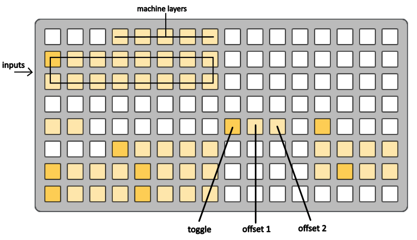
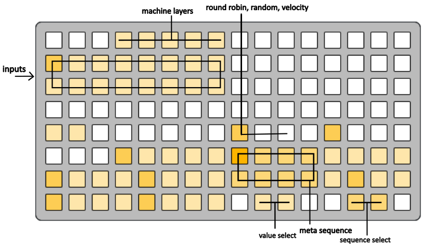

# drums 2 midi synth...

## sampler, sequence, sound, something

an augmented drumming script

developed by phillwilson and illges

# contents
- [getting started](#getting-started)
- [notes context](#notes-context)
    - [audition and direction](#audition-and-direction)
    - [editing sequence data](#editing-sequence-data)
    - [odds and ends](#odds-and-ends)
- [machine context](#machine-context)
    - [routing and velocity](#routing-and-velocity)
    - [layers and machines](#layers-and-machines)
    - [simple machines](#simple-machines)
        - [basic machine](#basic-machine)
        - [follow machine](#follow-machine)
        - [velocity machine](#velocity-machine)
        - [strum machine](#strum-machine)
        - [ratchet machine](#ratchet-machine)
        - [advance machine](#advance-machine)
        - [empty machine](#empty-machine)
    - [meta sequence machines](#meta-sequence-machines)
        - [riff machine](#riff-machine)
        - [fixed machine](#fixed-machine)
        - [stack machine](#stack-machine)
        - [prog machine](#prog-machine)
        - [chord machine](#chord-machine)
- [trig context](#trig-context)
    - [trig list](#trig-list)
        - [ab trig](#ab-trig)
        - [proxy trig](#proxy-trig)
        - [conductor trig](#conductor-trig)
        - [release trig](#release-trig)
        - [reset trig](#reset-trig)
        - [direction trig](#direction-trig)
        - [layer-mute trig](#layer-mute-trig)
        - [fill trig](#fill-trig)
        - [sustain trig](#sustain-trig)
        - [offset trig](#offset-trig)
        - [cc trig](#cc-trig)
        - [root trig](#root-trig)
        - [scale trig](#scale-trig)
        - [tap-tempo trig](#tap-tempo-trig)
        - [auto trig](#auto-trig)
        - [gears trig](#gears-trig)
- [cc context](#cc-context)
    - [editing sequence data](#cc-editing-sequence-data)
    - [odds and ends](#cc-odds-and-ends)
- [pattern context](#pattern-context)
- [patch context](#patch-context)
- [scene context](#scene-context)
- [play context](#play-context)
- [config](#config)
- [changelog](#changelog)
---
# getting started 

d2ms is intended as a utility script to send midi notes from drum triggers to synthesizers. this is achieved by an extensive midi routing system that maps assigned input signals to drive forward sequences of notes and automations. in other words, d2ms is a sequencer that is clock source agnostic. inputs that drive forward the many sequences could be coming from a physical drum hooked up to a midi trigger, a simple midi beat/drum pad, or a drum machine running on it's own clock. anything that can accept midi signals from norns can be paired with d2ms as a sound source.

## required
- norns/norns shield
- grid
## encouraged
- midi destination (hardware, software, etc.)
- midi source (to generate triggers)

## install via maiden
>;install https://github.com/illges/d2ms

## road map

## thanks

## videos

https://www.youtube.com/@D2MS-Script

## setup
By default d2ms is listening for input from midi channel 1, notes 36-51. Devices 1 and 2 from the norns midi device configuration will be defaulted as input and output respectively, but can be easily changed within system PARAMETERS>[device setup](#config).

>**note:** d2ms supports PSETS however due to the high number of parameters that the script saves/recalls, sometimes loading the
script can take a few seconds.

## data flow

## navigation
the main way to navigate throughout d2ms to edit sequences and signal routing is with the grid. The grid is organized into 8 contexts, represented by 8 grid buttons near the bottom right of the layout.

these **context selection buttons** will always be in the same place, no matter the current context of the grid. Switch to a new context by simply pressing one of the buttons. The name of the context as well as additional information will be displayed on the norns screen.

# notes context 

When the script first loads you will be presented with the **notes context**. (see above)

This is the where sequence data lives to be viewed and edited. Signals that are output by d2ms will be based (partially) on this data. More on this later in the [machine context](#machine-context).

The top four rows of the grid represent individual sequences of midi note data constrained to the global scale and root note. Switching grid pages will bring a new set of four sequence lanes into focus for editing and visual feedback (#1-4, 5-8, 9-12, 13-16).

Each step is a single note that can be updated individually on a per step basis using the piano or as a whole sequence with quick fill gestures. The PLAYHEAD of each lane is signified by the fully bright step (see above) and while the direction of the PLAYHEAD defaults from left to right, this can be changed using the directional gestures.

Pressing anywhere in one of the four displayed lanes will change the focused lane and step but WILL NOT update the current step of the PLAYHEAD. The lane that is currently in focus will be slightly brighter on the grid and the step data will be displayed on the norns screen.

 Sections SHORTER than the full 16 steps can be made with the resize gesture holding down the FIRST step that you wish to be in your sequence and then using a second finger to press the LAST step you wish to be in your sequence. Doing this gesture from right to left will also set the sequence direction to reverse.

 ## audition and direction 

 > **note:** each of the following gestures are actioned by holding the gesture button then pressing a sequence lane/step. 

**audition** - move PLAYHEAD to selected step and play the new step.

**advance** - play current step and advance PLAYHEAD.

**ab section** - switch between an A and B section. Both sections have separate directional setups and lengths, however note data is shared between the sections.

**invert direction** – switch between PLAYHEAD moving forward and backwards (lights up when backwards). 

**ping pong** - direction of sequence will invert on first and last step. 

**ping pong 2** - same as Ping Pong but first and last step of sequence plays twice before inverting direction.

**random Step** - every step advance moves to random step.

## editing sequence data 

holding a step/sequence and using **norns encoder 1** will change the entire sequence by octaves. 

holding a step/sequence and using **norns encoder 2** will change the entire sequence by one scale degree. 

holding a step and using **norns encoder 3** will change the step data by one scale degree. 

### piano

The bottom row of the grid is the piano, which provides direct access to two octaves of the currently selected root/scale combination. Pressing a button will play a note. Holding a note and pressing a sequence step will update the note data of the step.

**norns encoder 2** can be used to change the current root. 

**norns encoder 3** can be used to change the current scale. 

> **note:** root and scale are GLOBAL parameters, so they affect all output from both the piano playback of sequence steps.

**piano octave** can be changed with the two buttons above the first two piano keys. 

**(b) piano mute** button can be found to the right of the octave buttons. When ON, this will mute play back of the piano but editing step data will still work.

> **note:** piano midi out destination, default midi channel and midi out velocity can be changed in the norns params menu under PARAMERTERS>piano. 

### quick fill gestures:

> **note:** each of the following gestures are actioned by holding the gesture button then pressing a sequence lane/step. Sequence data will be overwritten, taking into account the current piano octave, current root, and current scale. The current gesture name will appear in the hint section of the norns screen so you can read the hint before committing and pressing a sequence.

**ascending/descending** - two octaves of the current scale. 

**triangle asc/desc** - first octave asc/desc, second octave desc/asc with minimal random variation. 

**narrow** - random notes pulled from a narrow distribution surrounding the middle piano key. 

**spiral** - notes spiralling out from the middle piano key. 

**scatter asc/desc** - random notes while still ascending or descending. 

**random** - random notes. 

**Shift + any above gesture** – fills all sequences with chosen gesture. (useful when randomizing)

**clear mutes** - unmutes all muted steps of the sequence. 

**mute step** - mutes selected step. 

**Shift + audition/adv** – nudges all note data of focused sequence left/right. 

**copy/paste** - copy selected sequence data to be pasted into another sequence. 

## odds and ends 

**global sequence reset** - pressing norns KEY 3 will reset all sequences back to the first step (notes, cc, meta, proxy)

**piano fill** - holding multiple notes on the piano and pressing a fill gesture will overwrite the focused sequence using the fill gesture and ONLY the current notes held from the piano. 

> **example:** Playing and holding a minor chord and pressing Fill Ascending will fill the focused sequence with a repeated ascending minor chord arpeggio.

**(a) piano link to machines** - when ON, play back of the piano will use currently selected input and layer from machine context to determine midi output channel and interval offset. When OFF, default midi channel is used from norns params menu. 

**(c) pattern chain ind** - (visual feedback only) light is on when currently focused sequence is chaining patterns. 

**(d) live record mode** - when ON, playing a note on the piano will fill the current step of the currently focused sequence and move the PLAYHEAD to the next step. (turn on and play melodies on the piano to fill the sequence quickly).  

**(e) lock step** – hold gesture and press sequence to lock the step data so it is not overwritten after a fill gesture or fill trig.

**(f) note lighting** - (visual feedback only) sequence lighting is brighter for high notes and dimmer for lower notes. 

**(g) preserve density** – hold gesture and press sequence to turn ON. When using the fill random gesture or trig, the number of step mutes in the lane will be preserved and the positions shuffled randomly. 

**(h,i) pattern inc/dec** - hold gesture and press sequence to increment/decrement pattern number of sequence.

**extended piano** - turn on under PARAMETERS>config to gain access to extended piano when in live record mode.

# machine context 

the bottom left of the grid represents the 16 inputs of d2ms. Each input is assigned a midi note and channel which determines whether incoming midi signals are routed to the input or not. 

each input has five velocity layers that allow further layering or forks in the routing path based on velocity.

pressing any of input/layer buttons selects the input/layer and displays related data on the norns screen.

## routing and velocity 

each layer has a velocity window (see norns screen) that determines if the incoming midi signal that has been routing to the current input will also be routed to the specific layers. If multiple layers have overlapping velocity windows, then one midi signal can trigger multiple layers at once.

**midi learn** - when holding an input and triggering a midi signal from an external device, the assigned note and channel of the input will be changed to the note and channel of the incoming signal. 

**midi learn velocity ceiling** – when holding **midi learn velocity high (b)** and an input and triggering a midi signal from an external device then the velocity ceiling of the input will be updated with the incoming midi velocity value. 

**midi learn velocity floor** - when holding **midi learn velocity low** (any velocity layer) and an input and triggering a midi signal from an external device then the velocity floor of the input will be updated with the incoming midi velocity value. 

>**note:** when a signal is routed to an input, the raw velocity value will be adjusted to the floor/ceiling if the value is below/above the floor/ceiling values respectively.

**midi learn velocity low** - when holding any velocity layer button and triggering a midi signal from an external device then the minimum velocity window value of the layer will be set to the incoming velocity value. 

**midi learn velocity high (b)** - when holding and triggering a midi signal from an external device then the maximum velocity window value of the current layer will be set to the incoming velocity value. 

>**note:** midi learn functionality can be turned off/locked under PARAMETERS>[config](#config)>lock midi learn. this can be useful to eliminate the possibility of accidental parameter updates while navigating between inputs/layers and receiving external signals simultaneously.

**clear velocity (a)** – hold and press any layer to reset velocity window back to 0-127. 

**quick set velocity** - hold layer and press layer to the right. the high velocity of the first will set the low velocity of the second layer. 

layers also have a probability setting that can be used to add in randomization/chance or completely block routing signals to a layer. Holding an input and pressing a layer will toggle between 100% and 0% probability. Use ENCODER 1 to high light probability on the norns screen, and ENCODER 3 to scroll through values.

**trig mask time** - can be configured under **PARAMETERS>input #>studio/venu trig mask time**. this is the amount of time an input will ignore subsequent triggers/signals after receiving a signal to process. useful to cut down unintended triggers when using acoustic drums with drum triggers. more on studio/venue under [config](#config).

## layers and machines 

the top 4 rows of the grid represent the note sequences in the notes context, allowing the layers to be routed to specific sequences by holding the layer button and pressing one of the sequences. Use the page buttons to route to sequences 5-16. 

instead of sequence steps, individual grid buttons in this context represents a midi channel, and pressing one without holding down a layer will toggle that midi channel on/off for signals routed to that sequence from that layer number.  

>**note:** active channels are shared globally by all layers of the same number across all inputs. The same is not true for layer routings to note lanes.

layers also have further control to specify whether signals are routed to note sequences, [cc sequences](#cc-context), or both.

**note send** – (toggle) when ON, route current layer to note lanes. 

**cc send** – (toggle) when ON, route current layer to cc lanes. 

each layer can be set to a different machine type to determine how routed signals interact with note sequences and play notes.

**machine select** – scroll through machine types for currently selected layer.

**shift + machine select** - change current patch. more on patches [here](#patch-context).

### common parameters

each machine has various parameters that can be adjusted within the machine setup area of the grid or the parameters row above the layer grid buttons.

**velocity pass** – (toggle) when ON, incoming/adjusted velocity is output. When OFF, default piano velocity is output. (PARAMETERS>piano) 

**monophonic** – (toggle) when ON, layer plays notes from sequences monophonically.  

**sustain time** – (toggle) switch between two sustain times (note on) for the layer. Can also be adjusted on the norns screen using ENCODERS 1 and 3.

**follow offset** – (toggle) used for some machines and Leader pointer routings. When ON, routes to the previous note/step of the sequence. When OFF, routes to the current step of the sequence. 

**leader pointer** - (routing) allows a machine sequence routing to be overwritten with a new routing while keeping the channels from the normal layer routing. useful for some situations. helps get around the fact that layers share channels globally. when using a leader routing the note sequence will not advance (machine becomes a follower).

**+/- interval** - taken into consideration when the final output note is calculated. The intervals allow for sequences to be filled with data without taking octaves into account so that different machines can offset the output note by octaves or other intervals (potentially layering to create chords).

## simple machines 

### basic machine 

when a basic machine is routed to a note sequence, the current step is played and then the PLAYHEAD advances one step. 

### follow machine 

when a follow machine is routed to a note sequence, the current step is played WITHOUT advancing the PLAYHEAD.

when **follow strum** is toggled ON, then the current step can follow an active strum that is in progress across a sequence, otherwise the base step of the strum is used.

### velocity machine 

when a velocity machine is routed to a note sequence, then the current velocity window of the layer is mapped across the length of the sequence. The adjusted velocity of the incoming midi event will determine which step of the sequence is played.

the calculated velocity steps can be seen on the norns display under the notes context by selecting a sequence and pressing either K2 or K3. The calculated values will update depending on the last layer that was routed to the machine.

### strum machine 

when a strum machine is routed to a note sequence then multiple notes are triggered across the sequence in a strummed fashion.

**strum division** determines the rate at which the strum advances across the sequence (calculated based on the global clock tempo set under PARAMETERS>clock).

**strum length** determines how many steps the strum will play.

by default, the first step of the strum is anchored as the current step of the sequence until the full strum completes. If subsequent strum events are routed to the sequence, then the previous strum is cancelled and a new strum is triggered from the anchored step.

**continue** - when toggled ON, if subsequent strum events are routed to the note sequence, then the anchor step is updated to the current step of the strum, the strum is cancelled, and a new strum is triggered from the new anchored step.

**block re-strum** - when toggled ON, if subsequent strum events routed to a note sequence are ignored until all active strums are completed.

by default, if a strum machine is routed to [cc sequences](#cc-context), the sequence will only advance one step per strum event.

**cc match** - when toggled ON, then every step advance of the strum will also advance the cc sequences. (keeping the cc sequence and note sequence synchronized)

### ratchet machine 

follows similar mechanics as a strum machine, however the current step is repeatedly played based on division and length parameters.

### advance machine 

when an advance machine is routed to a note sequence the PLAYHEAD advances one step without playing a note.

### empty machine 

signals routed to this machine are ignored.

## meta sequence machines 

some machines rely on a mechanism referred to as a meta sequence. These are smaller sequences (only 8 steps) that sequence additional parameters that interact with whatever note sequences the machine is routed to. Interacting with the meta sequence is similar to a normal note sequence, however when pressing a single step, the sequence collapses to that single step and allows editing the parameters of that step. To extend the sequence to include multiple steps, hold the first step and press a second.

**mute meta step** - **shift** + meta step.

**round robin** - when toggled ON, the meta sequence will advance in a forward direction.

**random** - when toggled ON, the meta sequence will jump to random steps.

**velocity** - when toggle ON, the incoming velocity is mapped to the sequence steps.

**reset mode** - when toggled ON, if the note sequence that the layer is routed to advances the step, then the meta sequence will reset the next time the machine is triggered (before the meta sequence is processed for playback).

**one shot mode** - when toggled ON, the meta sequence will only process once until reset either by reset mode or a [reset trig](#trig-context)

**lock/retrig mode** - when toggled ONCE, the meta sequence will only process once until released using a [release trig](#trig-context). if toggled TWICE to retrig mode, then advancement to the next step will be locked while the meta step will repeatedly play until released.

### riff machine 

the meta sequence for riff machines is made of up interval offsets. when a riff machine is routed to a note sequence, an output note is calculated based on the current step of the note sequence and the current interval value of the meta sequence. after the note is played ONLY the meta sequence advances, allowing a riff to be played via sequenced intervals over a base note from the sequence.

the +/- interval buttons will changes the interval of the selected meta sequence step.

holding **shift** and pressing +/- interval will update all steps within the length of the meta sequence simultaneously.

holding a step in the meta sequence will also display a playable interval selector in the top half of the grid. holding the step using the top of the grid is a faster way to select intervals across a larger range as well as receive audio feedback.

### fixed machine 

the meta sequence for fixed machines is made of up midi note numbers. when a fixed machine is routed to a note sequence ONLY the channel is taken from the layer routing. note sequences from the notes context are ignored. the intention of this machine is to easily setup and route specific midi notes to be used by an external drum rack or sample players.

the +/- interval buttons will changes the midi note of the selected meta sequence step chromatically (does not follow global scale).

### stack machine 

the meta sequence for stack machines is made up of *stacks* of interval offsets on each step. this machine works similiarly to the riff machine, except every meta step will play/strum a chord based on the stack step.

stacks must be manually configured/edited within the lua table in the following file: \dust\code\d2ms\lib\config\stack_chord_intervals.lua

default stacks have been included. organization of stacks is free to each user, however the default stacks are organized as chords with variations of each chord per stack. there are 16 main slots and each slot can contain up to 16 stacks.

when holding a meta sequence step, the stack selector will appear in the top of the grid. pressing the top row will select the slot and the specific stack can be chosen on grid row three.

the +/- interval buttons will changes the interval of the whole layer (interval is not per meta step).

holding **shift** and pressing +/- interval will update the clock division at which the stack will be strum. (1/0 means all notes played together)

### prog machine 

the meta sequence for prog machine is made up of chord and inversion structures. when a prog machine is routed to a note sequence, it will play the chord configured for the current meta sequence step, taking the root note from the note sequence. BOTH the meta sequence and note sequence steps will advance. (this machine has a limited use case but can be useful sometimes).

the +/- interval buttons will changes the interval of the whole layer (interval is not per meta step).

holding **shift** and pressing +/- interval will update the clock division at which the stack will be strum. (1/0 means all notes played together)

holding **chord params** and pressing the inside +/- interval buttons will change the chord type of the selected meta sequence step. using the outside +/- interval buttons will change the chord inversion.

### chord machine 

the meta sequence for chord machines is made of up interval offsets. this machine works similiarly to the riff machine, except every meta step will play each time a signal is routed to the machine. the note sequence will advance after the chord of intervals is played.

the +/- interval buttons will changes the interval of the selected meta sequence step.

holding **shift** and pressing +/- interval will update all steps within the length of the meta sequence simultaneously.

holding **strum div** and pressing +/- interval will update the clock division at which the chord will be strum. (1/0 means all notes played together)

**vel to density** - when toggled ON, the length of the chord will be determined by the adjusted velocity of the incoming signal.

**block re-strum** - subsequent signals will be ignored until the previous chord strum has completed.

holding a step in the meta sequence will also display a playable interval selector in the top half of the grid. holding the step using the top of the grid is a faster way to select intervals across a larger range as well as receive audio feedback.

# trig context 

the trig context is very similar to the machine context, with the inputs and layers referring to the same inputs and layers found in the machine context. this context allows layers to be routed to **trigs** which are processed *before machines*. trigs can be thought of as automated functions or parameter changes.

navigation of the trig context is the same as the [machine context](#machine-context), including the ability too midi learn for inputs and layer velocities, **clear velocity (a)**, and **midi learn velocity high (b)**.

depending on the trig type selected, the trig setup are will appear differently with varying options to configure the current trig.

trigs that have sequence lanes (note or cc) in the uppr part of the grid can be routed to them just like machines are. hold the trig layer and then press the sequence lane.

some trigs have a mirror of inputs/layers in the upper part of the grid.
this means that the trig is routed to a machine so that the parameters of the machine can be automated and updated before the next time the machine is triggered.
to route a trig to a machine layer, select the input in the upper grid with a single press and then toggle on the machine layer with single press (no need to hold the trig layer to make the routing).

## trig list 

### ab trig 

when ab trigs are routed to a sequence the **ab** state is toggled for that sequence.

if **prime** is toggled ON then the sequence **ab** state will wait to toggle until that sequence is routed to via a machine.
this is useful in the case where a follow machine is still pointed at a sequence and you don't want the state to change until the sequence would naturally advance.

### proxy trig 

allows for machine/trig layers to be triggered directly from other trig layers, effectively inserting the layer in the processing order.

by default the proxy trig starts in **sequence** mode allowing for the proxy trig to only execute on the first or last step of the **sequence** shown on row four of the grid. pressing a button on the grid row will update the sequence length and reset the sequence position to the start. if the division value is greater than zero then **reset** is always active while in **sequence** mode (even if the toggle is off). this means that the sequence will automatically reset to the start within the division time unless another trigger is routed to the proxy trig. setting the division to zero will allow for the sequence to only reset naturally. this can be useful if the proxy should only execute after multiple rapid triggers (drum roll, ghost note, etc.).

by default **1st step** is ON. toggle it off to have the proxy execute on the last step.

setting the trig to **delay** mode with **division** set to zero. with this setting when the proxy trigger is executed then all layers specified in the upper part of the grid will be executed via the proxy immediately.

increasing the division value using the grid buttons, the execution of the proxy destinations can be delayed by the designated division of the global norns clock value. if **reset** is toggled ON, then subsequent triggers of the proxy within the division time will cancel the previously queued delayed execution, allowing for a single execution of the destination layers once the delayed time has been reached without a subsequent trigger.

by default the layers in the upper grid represent **machines**, however by pressing the **route to trig** grid button then the proxy can execute other trig layers instead, causing the upper grid to represent **trigs**.

by default **ignore mutes** is set to ON, which means that muted layers can still be executed by the proxy trig. this is useful if the destination layers are on the same input as the proxy trig, and you only want the destination to be triggered only by the proxy execution (if the destination layer was unmuted then it would be executed by the proxy and during normal execution of the input/layers).

### conductor trig 

allows a [pattern](#pattern-context)/[patch](#patch-context)/[scene](#scene-context) sequence to be updated with a trig routing.

hold the current trig layer and press a pattern sequence to activate the routing for that pattern.

**pattern/patch/scene** routings are activate using the three toggles (default none active). all three can be active at once to advance all sequences in concert with one another.

if **direct** is set to 0 then the **pattern/patch/scene** will simply advance through unmuted **pattern/patch/scene** steps (or through a chained **pattern/patch/scene**), otherwise the **pattern/patch/scene** will be set to the specified number.

when **group** is toggled ON then if the **pattern/patch/scene** is currently being chained, the whole chain will move together.

### release trig 

allows trigs to send release signals to machines that are using the hold/retrig modes.

### reset trig 

allows the position of a note, cc, or machine meta sequence to be reset with a trig routing.

use **destination** to decide between note or cc sequence.

if **destination** is cc then use **channel** to determine which cc channel the sequences will be updated for.

if **destination** is meta, then the upper grid will change to allow machine layer routings.

### direction trig 

allows the direction parameter of a sequence to be updated when a trig is routed to the sequence.

use **destination** to decide between note or cc sequence.

use **direction** to decide which parameter type to update with.

if **destination** is cc then use **channel** to determine which cc channel the sequences will be updated for.

### layer mute trig 

allows the state of a machine layer **probability** to be toggled, muted, or unmuted when a trig is routed to the machine layer.

### fill trig 

allows a **quick fill gesture** for a note or cc sequence to be automated with a trig routing.

use **destination** to decide between note or cc sequence.

use **fill type** to decide which fill gesture to use.

if **destination** is cc then use **channel** to determine which cc channel the sequences will be updated for.

### sustain trig 

allows the state of a machine layer **sustain** to be toggled or set to sustain 1 or sustain 2.

### offset trig 

allows the state of a machine layer **offset** to be toggled or set to 0 or 1.

### cc trig 

allows a cc update to occur by a trig routing.

multiple midi channels can be specified using the **midi channel toggles** in the upper grid area.

**cc number** and **cc value** can be set using the selector buttons on the grid.

use the *cc pulse** button to send a signal to receiving software/hardware for midi learn/testing purposes.

### root trig 

allows the global **root/key** to be sequenced by a trig **meta sequence**.

### scale trig 

allows the global **scale type** to be sequenced by a trig **meta sequence**.

### tap tempo trig 

allows the global clock tempo to be updated with a trig routing.

the **tap tempo** button in the lower right of the grid will pulse in sync with the global clock setting. this button is present on many grid contexts of d2ms. pressing the tap tempo button 4 times will trigger a tempo update, working similiarly to tap tempo in other software/hardware. if another tap tempo signal is not received with 6 seconds then the sequence resets and the 4 tap count resets.

when a signal is routed to the **tap tempo** trig it works the same as pressing the **tap tempo** grid button.

when **global hold to tap** is toggled ON, then the **tap tempo** grid button turns into a sort of dead mans switch, where signals routed to the trig are ignored unless the **tap tempo** button is being held.

see the norns display for visual feedback on the tap tempo count and current global clock value.

### auto trig 

allows for automated sequencing of certain machine layer parameters with a trig meta sequence routing.

use the **sequence select** buttons to determine which machine parameter will be automated.

use the **value select** buttons to set the value for the current meta sequence step.

>**example**: set the auto trig to a division sequence (default). route the trig to a machine layer of the same layer number (so both trig and machine are processed during the same event). set the machine layer to strum type. in the trig meta sequence, set the division values in an increasing manner. switch the trig meta sequence from round robin to velocity. now when events are routed to the trig, the adjusted velocity of the event will determine what division value is used when processing the strum machine. harder hits will result in faster strums and softer hits will result in slower strums.

### gears trig 

allows a meta sequence of on/off switched to sit above machine layers so that the trig can control whether or not a machine will actually trigger.

>**example**: an incoming midi signal is routed to input 1 machine layer 1 (**basic machine**) and input 1 trig layer 1 (**gears machine**).the incoming signal is processed by the trig first, so the current step of the meta sequence is evaluated. if the meta step is ON, then the machine layer will process as normal with the basic machine playing a note and advancing the sequence. the next signal is processed by the **gears trig** and the meta step is OFF. when the machine layer is processed the signal will be ignored. this allows the machine layer to only be processed on occasion.

the **meta sequence** is made up of on/off switched. to change the value of a meta step hold the **toggle step** button and press the desired meta step.

when **retrig** is toggle ON, the machine layers are still able to play notes when the trig meta step is OFF, but the note sequences will not advance unless the the trig meta step is ON.

when **destination** is toggle to **trig** then the upper grid will represent trig layers, allowing the **gears trig** to be routed to other trigs.

>**note**: if the trig is routed to itself then it will be ignored. also if the **gears trig** is routed to a trig that comes before in teh processing order, the block will be applied to the destination trig during the next event.

# cc context 

this grid context is where cc sequences are configured to automate cc messages sent out to receiving software/hardware.

cc sequences work very similiarly to normal note sequences, with directional parameters and the ability to adjust sequence length and step values.

signals are routed to cc sequences on a per machine layer basis can be configured in the [machine context](#machine-context).

the bottom row of the grid represents the 16 midi channels that can be focused with a single press (channel 1 focused by default). once a channel is selected, the top 4 grid rows represent sequences of cc values for a given cc number. each midi channel has up to 16 cc sequences and the cc number of each is displayed on the norns screen (defaults to cc 1-16 in order). by default cc sequences are inactive. to activate a sequence, hold the desired midi channel button and press the cc sequence.

when a machine layer is configured to use cc sequences, it is routed to all active midi channels that are used for the note sequence routings. once a machine layer is routed to a midi channel in the cc context, all active cc sequences for that channel will respond to the incoming signal

## editing cc data 

**cc number** - hold anywhere on the cc sequence and use ENCODER 1, or press a sequence to bring into focus and use grid buttons **b/c**.

**cc step value** - hold desired step on a given sequence and use ENCODER 3. also, holding a step will cause the bottom of the grid to be replaced with a selection grid of stepped cc values. while holding a step, press one of these selection grid buttons to quickly choose between high and low values. after pressing a step, that step will be focused. use the **cc step +/-** buttons to nudge the step value slightly.

**quick fill gesture** - similar to quick fill gesture in the notes context. hold the gesture buttons and press the desired cc sequence to overwrite sequence data. a description of the gesture will appear on the norns screen under the hint.

**clear step (f)** - hold and press sequence step to set cc value to 0.

**shift (g)** - after pressing a sequence to bring it into focus, hold shift and press the **audition/advance** buttons to nudge the whole cc sequence data left or right.

## odds and ends 

**pulse cc (a)** - hold and press cc sequence to pulse that cc number with a value of 64. useful when receiving software/hardware has a midi learn/mapping mode.

**velocity mode (d)** - toggle ON per cc sequence to use adjusted velocity to determine which step is *played*. if off then each signal will advance the cc sequence one step.

**hide step position (e)** - useful when a sequence is in velocity mode. when in velocity mode AND toggled ON it hides the current step of the sequence so only value intensity is represented by the grid lighting.

**engine mode** - when toggle ON then cc sequences 1-4 of the current midi channel will be mapped to the super collider engine parameters instead of outputing cc messages. the name of the engine parameter is displayed at the top of the norns screen.

# pattern context 

the pattern context is a zoomed out version of the notes context. the top 4 rows of the grid represent *patterns* of note sequences, or sequences of note sequences. each step in the **pattern sequence** represents a singular note sequence.

by default, only the first pattern of every note sequence is active/unmuted.

pressing a step in the pattern sequence will automatically unmute the pattern and make it the active pattern, as well as breaking any **pattern chains**. the active sequence, step, and pattern can be seen in the top right of the norns screen in both the pattern and notes context.

**pattern chains** can be established by using the resize sequence gesture (holding one step and pressing another). when a pattern is being chained then the **chain indicator (c)** will light up in both the pattern and notes context for the focused sequence. when a pattern is chained, the pattern sequence will automatically increment when the end of a note sequence is reached.

to change the acive pattern within a chain without breaking the chain, hold the **select** button (same as audition button in notes context) and press the desired pattern step.

**quick fill gestures** can be used similiarly to the notes context. in this context holding a gesture and pressing a pattern step will overwite ONLY that pattern step (note sequence) data.

**copy/paste** can be used to copy pattern steps as well.

**live record mode** is also available in the pattern context and when a pattern is chained, playing notes can overwrite data across multiple patterns.

**encoder 2** changes the global root note. if holding a pattern step then all of the steps in the corresponding note sequence will inc/dec by 1 degree.

**encoder 3** changes the global scale. if holding a pattern step then all of the steps in the corresponding note sequence will inc/dec by an octave.

# patch context 

the patch context allows for sequencing the midi channel configuration (or patch) of the 5 machine/velocity layers. there is one sequence for all 5 layers. pressing one of the layers will display the channel configuration in the upper portion of the grid (similar to machine context).

to edit the sequence, steps, and chains follows the instructions from the [pattern context](#pattern-context).

automation of the sequence can be achieved with the [conductor trig](#conductor-trig).

**mute (a)** can be used to mute a sequence step.

# scene context 

the scene context allows for sequencing the layer mute/probability configuration (or scene) of each machine layer for all 16 inputs. there is only one global sequence with each scene containing a new configuration for all input/machine layers.

muting and unmuting layers works the same as the machine/trig contexts (hold the input and press the layer). to change layer probability, press the desired input and layer then use any of the encoders to update the value (see norns screen for percentage).

to edit the sequence, steps, and chains follows the instructions from the [pattern context](#pattern-context).

automation of the sequence can be achieved with the [conductor trig](#conductor-trig).

**copy/paste** can be used to copy sequence steps as well. (coming soon)

**mute** can be used to mute a sequence step.

# play context 

this context allows the 16 inputs of d2ms to be played directly from the grid. useful when testing or developing presets or when you simply do not have a midi device for input.

some editing of the machine layers is also available here, including velocity windows and machine selection.

by default, inputs 1-8 are displayed on the grid. holding buttone **(a)** will give access to inputs 9-16. by toggling OFF **page latch(b)**, pressing **(a)** will have a sticky affect, so switching between the inputs will act as a toggle instead of a momentary press.

# config 

under PARAMETERS>config in the norns params menu there are some options and toggles that can add or remove features (for things that might be WIP) or slightly change how certain aspects of d2ms works.

**setup** - chooses between 2 different setups that have their own velocity floor/ceiling and trig mask times. useful for when a sepcific preset might be used on two different setups (midi pad versus acoustice drum kit with triggers).

**medium piano** - a medium sized piano is used for live recording mode.

**external piano input** - allows for an external midi keyboard to be used for note sequence input in and out of live record mode. set input channel and device under PARAMETERS>piano.

**round bpm** - when ON then tap tempo result will be rounded to the nearest whole number.

**lock midi learn** - turn on so that pressing input and layer buttons on the grid will not accidentally overwrite configured midi values on accident if also triggering midi input.

**grid light pulse** - when ON grid lights pulse when signals are routed as visual feedback. ability to turn off as sometimes this seems to cause some processing issues under certain circumstances.

**sticky contexts** - when toggle ON, the currently selected input and layer will carry over between machine and trig context.

**linked velocity layers** - by default ON so machine and trig layers share same velocity window values.

**process all trigs first** - defaulted to ON. when turned off, processing will go by input, layer, trig , machine.
(default processing is all inputs, layers, trigs, AND then all inputs, layers machines)

**pulse min cc slot off** - when toggled ON, after deactivating a cc sequence, a value of 0 will pulse for that cc number.

**extend strum reset window** - adjusts the timing on the end of a strum. by default after the last note is played the strum technically ends. when this is toggled ON then the strum will not end until the note is played and the division time interval is reached.

**hold to tap** - global hold to tap toggle, also found in tap tempo trig setup.

**debug toggles** - print information to repl for various processes.

# changelog 

---
### v1.0.1
- remove reset on adv function from conductor trig until it is more developed
---
### v1.0.0
- deploy major version 1
---
