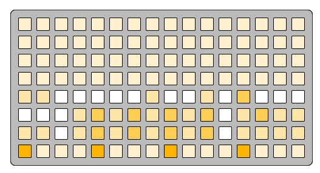
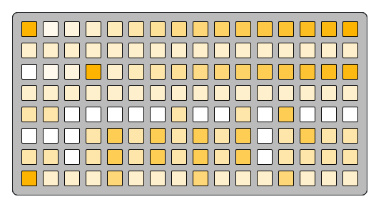

# cc context

cc-context
```
3 3 3 3 3 3 3 3 3 3 3 3 3 3 3 3
3 3 3 3 3 3 3 3 3 3 3 3 3 3 3 3
3 3 3 3 3 3 3 3 3 3 3 3 3 3 3 3
3 3 3 3 3 3 3 3 3 3 3 3 3 3 3 3
5 5 0 0 0 0 0 5 0 0 5 0 a 0 0 0
0 0 0 5 a 5 a 5 a 5 a 0 5 a 5 5
5 5 0 5 a 5 a 5 a 5 a 0 5 5 5 5
f 3 3 3 8 3 3 3 8 3 3 3 8 3 3 3
```

---

cc-context-active-lanes
```
f 1 2 3 4 5 6 7 8 9 a b c d e f
3 3 3 3 3 3 3 3 3 3 3 3 3 3 3 3
0 1 2 f 3 4 5 6 7 8 9 a b c d e
3 3 3 3 3 3 3 3 3 3 3 3 3 3 3 3
5 5 0 0 0 0 0 5 0 0 5 0 a 0 0 0
0 0 0 5 a 5 a 5 a 5 a 0 5 a 5 5
5 5 0 5 a 5 a 5 a 5 a 0 5 5 5 5
f 3 3 3 8 3 3 3 8 3 3 3 8 3 3 3
```

---