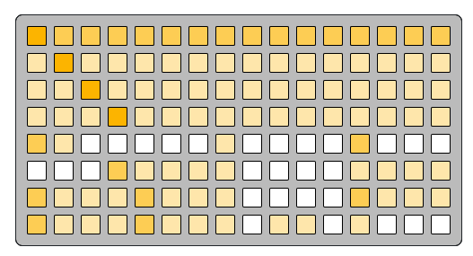
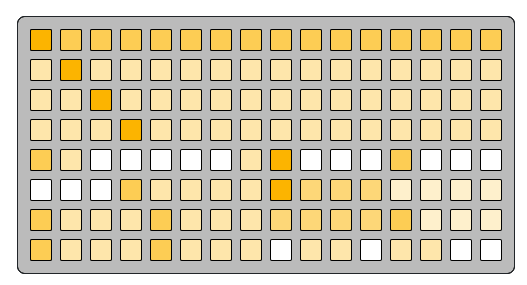
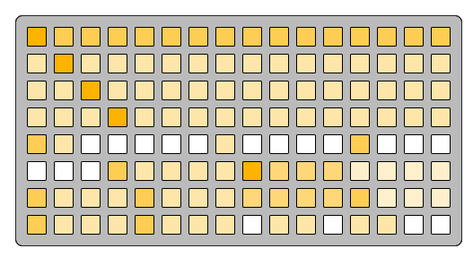

# machine context

machine-context-basic-velocity
```
f a a a a a a a a a a a a a a a
5 f 5 5 5 5 5 5 5 5 5 5 5 5 5 5
5 5 f 5 5 5 5 5 5 5 5 5 5 5 5 5
5 5 5 f 5 5 5 5 5 5 5 5 5 5 5 5
a 5 0 0 0 0 0 5 0 0 0 0 a 0 0 0
0 0 0 a 5 5 5 5 0 0 0 0 5 5 5 5
a 5 5 5 a 5 5 5 0 0 0 0 a 5 5 5
a 5 5 5 a 5 5 5 0 5 5 0 5 0 0 0
```

---
machine-context-riff-fixed-stack-prog
```
f a a a a a a a a a a a a a a a
5 f 5 5 5 5 5 5 5 5 5 5 5 5 5 5
5 5 f 5 5 5 5 5 5 5 5 5 5 5 5 5
5 5 5 f 5 5 5 5 5 5 5 5 5 5 5 5
a 5 0 0 0 0 0 5 f 0 0 0 a 0 0 0
0 0 0 a 5 5 5 5 f 8 8 8 3 3 3 3
a 5 5 5 a 5 5 5 8 8 8 8 a 3 3 3
a 5 5 5 a 5 5 5 0 5 5 0 5 5 0 0
```

---
machine-context-chord
```
f a a a a a a a a a a a a a a a
5 f 5 5 5 5 5 5 5 5 5 5 5 5 5 5
5 5 f 5 5 5 5 5 5 5 5 5 5 5 5 5
5 5 5 f 5 5 5 5 5 5 5 5 5 5 5 5
a 5 0 0 0 0 0 5 0 0 0 0 a 0 0 0
0 0 0 a 5 5 5 5 f 8 8 8 3 3 3 3
a 5 5 5 a 5 5 5 8 8 8 8 a 3 3 3
a 5 5 5 a 5 5 5 0 5 5 0 5 5 0 0
```

---
machine-context-strum-ratchet
```
f a a a a a a a a a a a a a a a
5 f 5 5 5 5 5 5 5 5 5 5 5 5 5 5
5 5 f 5 5 5 5 5 5 5 5 5 5 5 5 5
5 5 5 f 5 5 5 5 5 5 5 5 5 5 5 5
a 5 0 0 0 0 0 5 0 a 0 0 a 0 0 0
0 0 0 a 5 5 5 5 0 5 5 0 3 3 3 3
a 5 5 5 a 5 5 5 0 5 5 0 a 3 3 3
a 5 5 5 a 5 5 5 0 5 5 0 5 0 0 0
```

---
machine-context-follow
```
f a a a a a a a a a a a a a a a
5 f 5 5 5 5 5 5 5 5 5 5 5 5 5 5
5 5 f 5 5 5 5 5 5 5 5 5 5 5 5 5
5 5 5 f 5 5 5 5 5 5 5 5 5 5 5 5
a 5 0 0 0 0 0 5 0 0 0 0 a 0 0 0
0 0 0 a 5 5 5 5 0 0 0 0 5 5 5 5
a 5 5 5 a 5 5 5 0 5 0 0 a 5 5 5
a 5 5 5 a 5 5 5 0 5 5 0 5 0 0 0
```

---