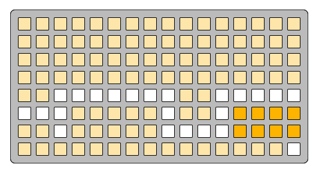

# notes context

focus-context-buttons
```
5 5 5 5 5 5 5 5 5 5 5 5 5 5 5 5
5 5 5 5 5 5 5 5 5 5 5 5 5 5 5 5
5 5 5 5 5 5 5 5 5 5 5 5 5 5 5 5
5 5 5 5 5 5 5 5 5 5 5 5 5 5 5 5
5 5 0 0 0 0 0 0 0 5 5 0 0 0 0 0
0 0 0 5 5 5 5 5 0 5 5 0 f f f f
5 5 0 5 5 5 5 5 0 0 0 0 f f f f
5 5 5 5 5 5 5 5 5 5 5 5 5 5 5 0
```

---

notes-context
```
f a a a a a a a a a a a a a a a
f 5 5 5 5 5 5 5 5 5 5 5 5 5 5 5
f 5 5 5 5 5 5 5 5 5 5 5 5 5 5 5
f 5 5 5 5 5 5 5 5 5 5 5 5 5 5 5
5 5 0 0 0 0 0 0 0 5 5 0 a 0 0 0
0 0 a 5 5 5 5 5 0 5 5 0 a 5 5 5
a a 0 5 5 5 5 5 0 0 0 0 5 5 5 5
a 5 5 5 5 5 5 a 5 5 5 5 5 5 a 0
```

---

notes-context-upper-grid
```
a f a a a a a a a a a a a a a a
5 5 5 5 f 5 5 5 5 5 5 5 5 5 5 5
5 5 5 5 5 5 5 5 5 5 5 f 5 5 5 5
5 5 5 f 5 5 5 5 5 5 5 5 5 5 5 5
5 5 0 0 0 0 0 0 0 5 5 0 0 a 0 0
0 0 a 5 5 5 5 5 0 5 5 0 a 5 5 5
a a 0 5 5 5 5 5 0 0 0 0 5 5 5 5
a 5 5 5 5 5 5 a 5 5 5 5 5 5 a 0
```

---