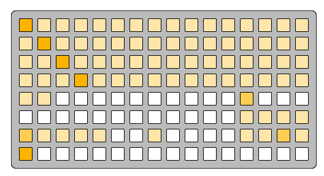

# patch context

patch-context
```
f 5 5 5 5 5 5 5 5 5 5 5 5 5 5 5
5 f 5 5 5 5 5 5 5 5 5 5 5 5 5 5
5 5 f 5 5 5 5 5 5 5 5 5 5 5 5 5
5 5 5 f 5 5 5 5 5 5 5 5 5 5 5 5
5 5 0 0 0 0 0 0 0 0 0 0 a 0 0 0
0 0 0 0 0 0 0 0 0 0 0 0 5 5 5 5
a 5 5 5 5 0 0 5 0 0 0 0 5 5 a 5
f 0 0 0 0 0 0 0 0 0 0 0 0 0 0 0
```

---