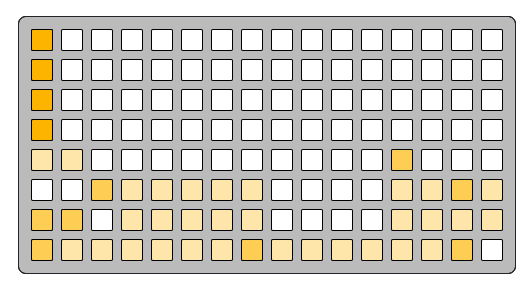
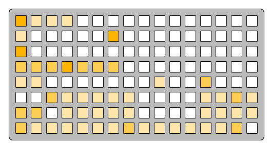

# pattern context

pattern-context
```
f 0 0 0 0 0 0 0 0 0 0 0 0 0 0 0
f 0 0 0 0 0 0 0 0 0 0 0 0 0 0 0
f 0 0 0 0 0 0 0 0 0 0 0 0 0 0 0
f 0 0 0 0 0 0 0 0 0 0 0 0 0 0 0
5 5 0 0 0 0 0 0 0 5 0 0 a 0 0 0
0 0 a 5 5 5 5 5 0 0 0 0 5 5 a 5
a a 0 5 5 5 5 5 0 0 0 0 5 5 5 5
a 5 5 5 5 5 5 a 5 5 5 5 5 5 a 0
```

---

pattern-context-chains
```
f 5 5 5 0 0 0 0 0 0 0 0 0 0 0 0
5 0 0 0 0 0 f 0 0 0 0 0 0 0 0 0
f 0 0 0 0 0 0 0 0 0 0 0 0 0 0 0
a a a f a a a 0 0 0 0 0 0 0 0 0
5 5 0 0 0 0 0 0 0 5 0 0 a 0 0 0
0 0 a 5 5 5 5 5 0 0 0 0 5 5 a 5
a a 0 5 5 5 5 5 0 0 0 0 5 5 5 5
a 5 5 5 5 5 5 a 5 5 5 5 5 5 a 0
```

---