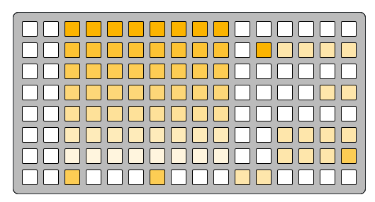

# play context

play-context
```
0 0 f f f f f f f f 0 0 0 0 0 0
0 0 c c c c c c c c 0 f 5 5 5 5
0 0 a a a a a a a a 0 0 0 0 0 0
0 0 8 8 8 8 8 8 8 8 0 0 0 0 5 5
0 0 6 6 6 6 6 6 6 6 0 0 0 0 0 0
0 0 4 4 4 4 4 4 4 4 0 0 5 5 5 5
0 0 2 2 2 2 2 2 2 2 0 0 5 5 5 a
0 0 a 0 0 0 a 0 0 0 5 5 0 0 0 0
```

---