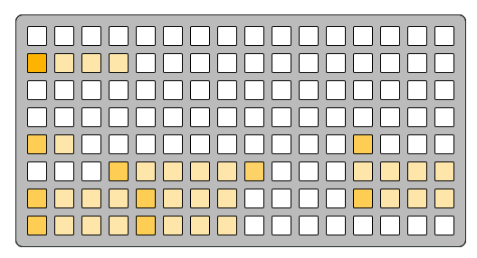

# scene context

scene-context
```
0 0 0 0 0 0 0 0 0 0 0 0 0 0 0 0
f 5 5 5 0 0 0 0 0 0 0 0 0 0 0 0
0 0 0 0 0 0 0 0 0 0 0 0 0 0 0 0
0 0 0 0 0 0 0 0 0 0 0 0 0 0 0 0
a 5 0 0 0 0 0 0 0 0 0 0 a 0 0 0
0 0 0 a 5 5 5 5 9 0 0 0 5 5 5 5
a 5 5 5 a 5 5 5 0 0 0 0 a 5 5 5
a 5 5 5 a 5 5 5 0 0 0 0 0 0 0 0
```

---