# trig context

trig-context-ab
```
5 5 5 5 5 5 5 5 5 5 5 5 5 5 5 5
5 5 5 5 5 5 5 5 5 5 5 5 5 5 5 5
5 5 5 5 5 5 5 5 5 5 5 5 5 5 5 5
5 5 5 5 5 5 5 5 5 5 5 5 5 5 5 5
5 5 0 0 0 0 0 0 0 0 0 0 a 0 0 0
0 0 0 a 5 5 5 5 0 5 0 0 5 5 5 5
a 5 5 5 a 5 5 5 0 0 0 0 5 a 5 5
a 5 5 5 a 5 5 5 0 0 0 0 0 0 0 0
```
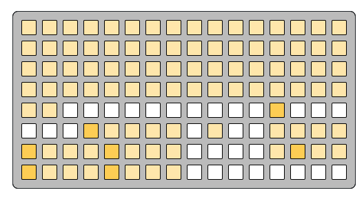
---
trig-context-direction
```
5 5 5 5 5 5 5 5 5 5 5 5 5 5 5 5
5 5 5 5 5 5 5 5 5 5 5 5 5 5 5 5
5 5 5 5 5 5 5 5 5 5 5 5 5 5 5 5
5 5 5 5 5 5 5 5 5 5 5 5 5 5 5 5
5 5 0 0 0 0 0 0 0 0 0 0 a 0 0 0
0 0 0 a 5 5 5 5 0 0 0 0 5 5 5 5
a 5 5 5 a 5 5 5 0 5 5 0 5 a 5 5
a 5 5 5 a 5 5 5 0 5 5 0 0 0 0 0
```

---
trig-context-layer-mute
```
0 0 0 5 5 5 5 5 0 0 0 0 0 0 0 0
a 5 5 5 5 5 5 5 0 0 0 0 0 0 0 0
5 5 5 5 5 5 5 5 0 0 0 0 0 0 0 0
0 0 0 0 0 0 0 0 0 0 0 0 0 0 0 0
5 5 0 0 0 0 0 0 a 5 5 0 a 0 0 0
0 0 0 a 5 5 5 5 0 0 0 0 5 5 5 5
a 5 5 5 a 5 5 5 0 0 0 0 5 a 5 5
a 5 5 5 a 5 5 5 0 0 0 0 0 0 0 0
```
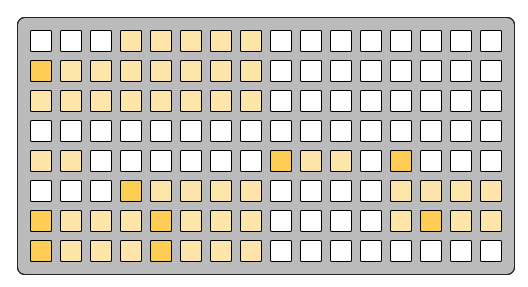
---
trig-context-reset
```
5 5 5 5 5 5 5 5 5 5 5 5 5 5 5 5
5 5 5 5 5 5 5 5 5 5 5 5 5 5 5 5
5 5 5 5 5 5 5 5 5 5 5 5 5 5 5 5
5 5 5 5 5 5 5 5 5 5 5 5 5 5 5 5
5 5 0 0 0 0 0 0 0 0 0 0 a 0 0 0
0 0 0 a 5 5 5 5 0 0 0 0 5 5 5 5
a 5 5 5 a 5 5 5 0 0 0 0 5 a 5 5
a 5 5 5 a 5 5 5 0 5 5 0 0 0 0 0
```
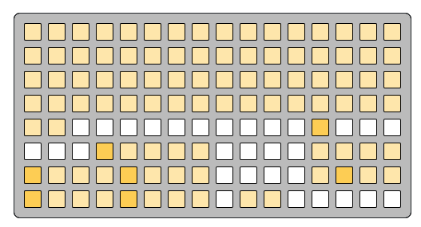
---
trig-context-gears
```
0 0 0 5 5 5 5 5 0 0 0 0 0 0 0 0
a 5 5 5 5 5 5 5 0 0 0 0 0 0 0 0
5 5 5 5 5 5 5 5 0 0 0 0 0 0 0 0
0 0 0 0 0 0 0 0 0 0 0 0 0 0 0 0
5 5 0 0 0 0 0 0 a 5 0 0 a 0 0 0
0 0 0 a 5 5 5 5 f 8 8 c 5 5 5 5
a 5 5 5 a 5 5 5 8 8 8 c 5 a 5 5
a 5 5 5 a 5 5 5 0 5 0 0 0 0 0 0
```
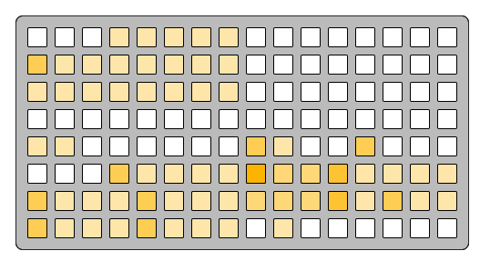
---
trig-context-conductor
```
5 5 5 5 5 5 5 5 5 5 5 5 5 5 5 5
5 5 5 5 5 5 5 5 5 5 5 5 5 5 5 5
5 5 5 5 5 5 5 5 5 5 5 5 5 5 5 5
5 5 5 5 5 5 5 5 5 5 5 5 5 5 5 5
5 5 0 0 0 0 0 0 5 5 5 0 a 0 0 0
0 0 0 a 5 5 5 5 0 0 0 0 5 5 5 5
a 5 5 5 a 5 5 5 0 5 0 0 5 a 5 5
a 5 5 5 a 5 5 5 0 5 5 0 0 0 0 0
```
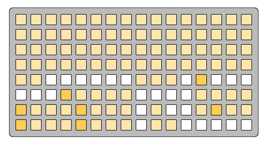
---
trig-context-pattern
```
5 5 5 5 5 5 5 5 5 5 5 5 5 5 5 5
5 5 5 5 5 5 5 5 5 5 5 5 5 5 5 5
5 5 5 5 5 5 5 5 5 5 5 5 5 5 5 5
5 5 5 5 5 5 5 5 5 5 5 5 5 5 5 5
5 5 0 0 0 0 0 0 0 0 0 0 a 0 0 0
0 0 0 a 5 5 5 5 0 0 0 0 5 5 5 5
a 5 5 5 a 5 5 5 0 5 0 0 5 a 5 5
a 5 5 5 a 5 5 5 0 5 5 0 0 0 0 0
```
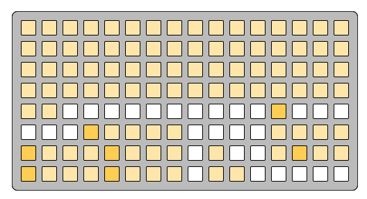
---
trig-context-patch
```
0 0 0 0 0 0 0 0 0 0 0 0 0 0 0 0
0 0 0 0 0 0 0 0 0 0 0 0 0 0 0 0
0 0 0 0 0 0 0 0 0 0 0 0 0 0 0 0
0 0 0 0 0 0 0 0 0 0 0 0 0 0 0 0
5 5 0 0 0 0 0 0 0 0 0 0 a 0 0 0
0 0 0 a 5 5 5 5 0 0 0 0 5 5 5 5
a 5 5 5 a 5 5 5 0 5 0 0 5 a 5 5
a 5 5 5 a 5 5 5 0 5 5 0 0 0 0 0
```
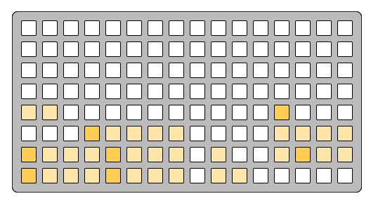
---
trig-context-fill
```
5 5 5 5 5 5 5 5 5 5 5 5 5 5 5 5
5 5 5 5 5 5 5 5 5 5 5 5 5 5 5 5
5 5 5 5 5 5 5 5 5 5 5 5 5 5 5 5
5 5 5 5 5 5 5 5 5 5 5 5 5 5 5 5
5 5 0 0 0 0 0 0 0 0 0 0 a 0 0 0
0 0 0 a 5 5 5 5 0 0 0 0 5 5 5 5
a 5 5 5 a 5 5 5 0 5 5 0 5 a 5 5
a 5 5 5 a 5 5 5 0 5 5 0 0 0 0 0
```
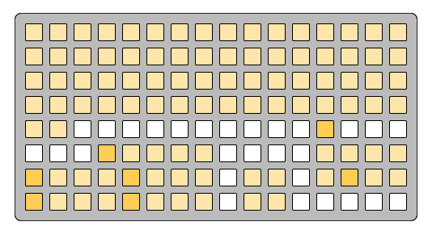
---
trig-context-sustain
```
0 0 0 5 5 5 5 5 0 0 0 0 0 0 0 0
a 5 5 5 5 5 5 5 0 0 0 0 0 0 0 0
5 5 5 5 5 5 5 5 0 0 0 0 0 0 0 0
0 0 0 0 0 0 0 0 0 0 0 0 0 0 0 0
5 5 0 0 0 0 0 0 a 5 5 0 a 0 0 0
0 0 0 a 5 5 5 5 0 0 0 0 5 5 5 5
a 5 5 5 a 5 5 5 0 0 0 0 5 a 5 5
a 5 5 5 a 5 5 5 0 0 0 0 0 0 0 0
```
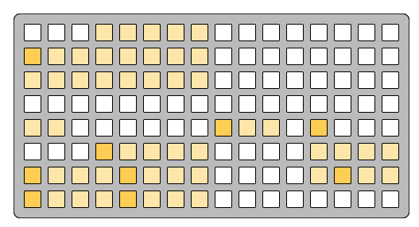
---
trig-context-offset
```
0 0 0 5 5 5 5 5 0 0 0 0 0 0 0 0
a 5 5 5 5 5 5 5 0 0 0 0 0 0 0 0
5 5 5 5 5 5 5 5 0 0 0 0 0 0 0 0
0 0 0 0 0 0 0 0 0 0 0 0 0 0 0 0
5 5 0 0 0 0 0 0 a 5 5 0 a 0 0 0
0 0 0 a 5 5 5 5 0 0 0 0 5 5 5 5
a 5 5 5 a 5 5 5 0 0 0 0 5 a 5 5
a 5 5 5 a 5 5 5 0 0 0 0 0 0 0 0
```

---
trig-context-cc
```
0 0 0 0 0 0 0 0 0 0 0 0 0 0 0 0
5 5 5 5 5 5 5 5 5 5 5 5 5 5 5 5
0 0 0 0 0 0 0 0 0 0 0 0 0 0 0 0
0 0 0 0 0 0 0 0 0 0 0 0 0 0 0 0
5 5 0 0 0 0 0 0 5 0 0 0 a 0 0 0
0 0 0 a 5 5 5 5 0 5 5 0 5 5 5 5
a 5 5 5 a 5 5 5 0 0 0 0 5 a 5 5
a 5 5 5 a 5 5 5 0 5 5 0 0 0 0 0
```
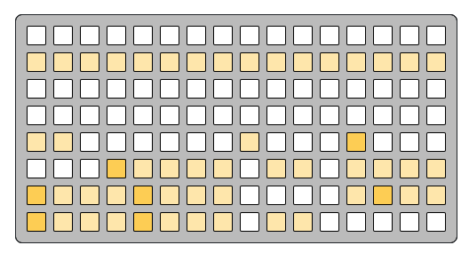
---
trig-context-root
```
0 0 0 0 0 0 0 0 0 0 0 0 0 0 0 0
0 0 0 0 0 0 0 0 0 0 0 0 0 0 0 0
0 0 0 0 0 0 0 0 0 0 0 0 0 0 0 0
0 0 0 0 0 0 0 0 0 0 0 0 0 0 0 0
5 5 0 0 0 0 0 0 a 0 0 0 a 0 0 0
0 0 0 a 5 5 5 5 f 8 8 8 5 5 5 5
a 5 5 5 a 5 5 5 8 8 8 8 5 a 5 5
a 5 5 5 a 5 5 5 0 5 5 0 0 0 0 0
```
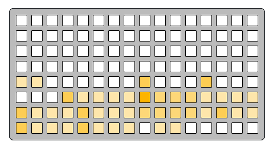
---
trig-context-scale
```
0 0 0 0 0 0 0 0 0 0 0 0 0 0 0 0
0 0 0 0 0 0 0 0 0 0 0 0 0 0 0 0
0 0 0 0 0 0 0 0 0 0 0 0 0 0 0 0
0 0 0 0 0 0 0 0 0 0 0 0 0 0 0 0
5 5 0 0 0 0 0 0 a 0 0 0 a 0 0 0
0 0 0 a 5 5 5 5 f 8 8 8 5 5 5 5
a 5 5 5 a 5 5 5 8 8 8 8 5 a 5 5
a 5 5 5 a 5 5 5 0 5 5 0 0 0 0 0
```

---
trig-context-tap-tempo
```
0 0 0 0 0 0 0 0 0 0 0 0 0 0 0 0
0 0 0 0 0 0 0 0 0 0 0 0 0 0 0 0
0 0 0 0 0 0 0 0 0 0 0 0 0 0 0 0
0 0 0 0 0 0 0 0 0 0 0 0 0 0 0 0
5 5 0 0 0 0 0 0 0 0 0 0 a 0 0 0
0 0 0 a 5 5 5 5 0 5 0 0 5 5 5 5
a 5 5 5 a 5 5 5 0 0 0 0 5 a 5 5
a 5 5 5 a 5 5 5 0 0 0 0 0 0 0 f
```
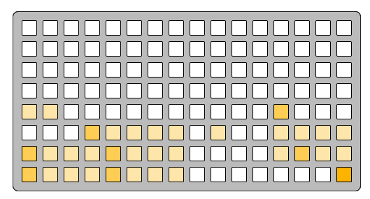
---
trig-context-auto
```
0 0 0 5 5 5 5 5 0 0 0 0 0 0 0 0
a 5 5 5 5 5 5 5 0 0 0 0 0 0 0 0
5 5 5 5 5 5 5 5 0 0 0 0 0 0 0 0
0 0 0 0 0 0 0 0 0 0 0 0 0 0 0 0
5 5 0 0 0 0 0 0 a 0 0 0 a 0 0 0
0 0 0 a 5 5 5 5 f 8 8 8 5 5 5 5
a 5 5 5 a 5 5 5 8 8 8 8 5 a 5 5
a 5 5 5 a 5 5 5 0 5 5 0 0 8 8 0
```
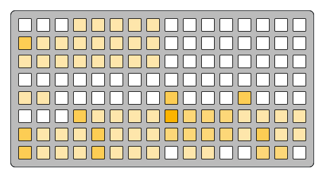
---
trig-context-proxy
```
0 0 0 5 5 5 5 5 0 0 0 0 0 0 0 0
a 5 5 5 5 5 5 5 0 0 0 0 0 0 0 0
5 5 5 5 5 5 5 5 0 0 0 0 0 0 0 0
f 2 2 2 2 2 2 2 0 0 0 0 0 0 0 0
5 5 0 0 0 0 0 0 0 5 0 0 a 0 0 0
0 0 0 a 5 5 5 5 0 5 5 0 5 5 5 5
a 5 5 5 a 5 5 5 0 a a 0 5 a 5 5
a 5 5 5 a 5 5 5 0 5 5 0 0 0 0 0
```
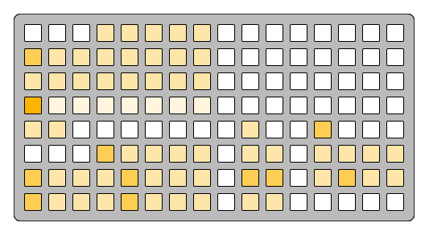
---
trig-context-release
```
0 0 0 5 5 5 5 5 0 0 0 0 0 0 0 0
a 5 5 5 5 5 5 5 0 0 0 0 0 0 0 0
5 5 5 5 5 5 5 5 0 0 0 0 0 0 0 0
0 0 0 0 0 0 0 0 0 0 0 0 0 0 0 0
5 5 0 0 0 0 0 0 0 0 0 0 a 0 0 0
0 0 0 a 5 5 5 5 0 0 0 0 5 5 5 5
a 5 5 5 a 5 5 5 0 0 0 0 5 a 5 5
a 5 5 5 a 5 5 5 0 0 0 0 0 0 0 0
```
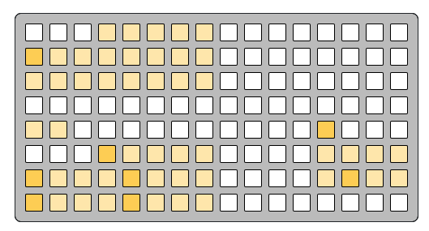
---